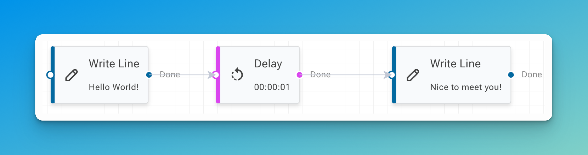

# Elsa Workflows 3

Elsa Workflows is a set of open-source .NET libraries designed to enhance .NET applications with workflow capabilities. Think of it as lego blocks for creating workflow engines in .NET.

Workflows in Elsa can be defined in different ways:

* Programmatically by writing .NET code.
* Visually using the built-in designer, non-developers or those who prefer a visual approach can create and modify workflows with ease.
* Declaratively using JSON.

## Defining Workflows

Define workflows programmatically using .NET code:

```csharp
// Define workflows directly from code.
var workflow = new Sequence
{
    Activities =
    {
        new WriteLine("Hello World!"),
        new Delay(TimeSpan.FromSeconds(1)),
        new WriteLine("It is nice to meet you!")
    }
};
```

And/or, define workflows visually using [Elsa Studio](application-types/elsa-studio.md):

<div data-full-width="false"><figure><figcaption><p><kbd>Design workflows visually</kbd></p></figcaption></figure></div>

And/or, define workflows declaratively using JSON:

```json
{
  "id": "1",
  "definitionId": "1",
  "name": "Hello World",
  "version": 1,
  "root": {
    "id": "Flowchart1",
    "type": "Elsa.Flowchart",
    "activities": [
      {
        "id": "WriteLine1",
        "type": "Elsa.WriteLine",
        "text": {
          "typeName": "String",
          "expression": {
            "type": "Literal",
            "value": "Hello World!"
          }
        }
      }
    ]
  }
}
```


## Use Cases

1. **Integrate Workflow Execution in .NET Applications**: Add workflow execution capabilities to existing applications.
2. **Standalone Workflow Server**: Deploy Elsa as an independent workflow server to manage various business processes across your organisation.
3. **Prebuilt Docker Containers**: Instead of building a custom workflow server, there is the option of hosting a prebuilt Docker image that acts as a standalone workflow server that exposes REST APIs to interact with the engine.

## Key Features

1. **Long & Short Running Workflows**: Workflows can both be short-lived completing in milliseconds, as well as long-lived, potentially spanning hours, days, weeks, months and even years.
2. **Activity Library**: Elsa offers a rich set of out-of-the-box activities, providing essential building blocks to construct flexible and effective workflows tailored to your business needs.
3. **Triggers**: Workflows can be initiated automatically based on specific events or conditions, enabling seamless automation and integration with existing processes.
4. **Dynamic Expressions**: Elsa allows the use of C#, JavaScript, or Liquid expressions for dynamic value evaluation during runtime, enhancing workflow logic. You can customize it as Elsa is highly modular and extensible.
5. **Extensibility**: Elsa is built to be extensible, making it easy to add custom activities and connect with other systems.
6. **Reusable Web-Based Designer**: With the web-based drag & drop designer hosted in Elsa Studio, users can visually create workflows, leveraging a modular and extensible framework.
7. **Scalable Performance**: Elsa is designed for high performance, working across multiple nodes in a cluster for horizontal scaling.

## Known Limitations

Elsa is continually evolving, and while it offers powerful capabilities, there are some known limitations and ongoing work:

* Documentation is still a work in progress.
* Starting workflows from the designer is currently supported only for workflows that do not require input and do not start with a trigger; this is planned for a future release.
* The designer currently only supports Flowchart activities. Support for Sequence and StateMachine activities is planned for a future release.
* UI input validation is not yet implemented.

