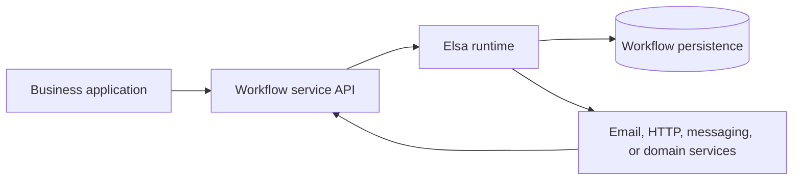

# Adoption evidence and case studies

This page helps teams evaluate Elsa using evidence that can be checked. It
also explains the difference between a public customer reference, an official
sample, and an architecture pattern that you can adapt.

## What is publicly verifiable?

The original request for this page asks for named organizations using Elsa in
production ([issue #82](https://github.com/elsa-workflows/elsa-gitbook/issues/82)).
The documentation does not currently maintain a verified, named customer
list. Do not treat an anonymous community description or an Elsa sample as a
customer reference.

| Evidence | What it demonstrates | How to use it |
| --- | --- | --- |
| [Anonymous ERP and portal architecture](https://github.com/elsa-workflows/elsa-core/discussions/1002) | A publicly described design with an ASP.NET Core workflow server, portal-facing API controllers, approval signals, and correlation IDs. | Use it as a historical architecture pattern, not as a named customer reference or a claim about a current Elsa release. |
| [Core reference server](https://github.com/elsa-workflows/elsa-core/tree/release/3.8.0/src/apps/Elsa.Server.Web) | A server host that manages and executes workflows through Elsa services, persistence, runtime, and API modules. | Use it to understand a self-hosted workflow-server baseline. It is reference code, not proof of production readiness by itself. |
| [Core Docker reference app](https://github.com/elsa-workflows/elsa-core/blob/5429008d98a56afd29b4fd11107f7760710b1a64/README.md#try-with-docker) | A combined Elsa Server + Studio development path. | Use it for evaluation and local exploration. The release README explicitly says the reference image is not intended for production use. |
| [Elsa Studio hosts](https://github.com/elsa-workflows/elsa-studio/tree/release/3.8.0/src/hosts) | Server-side and WebAssembly Studio hosts that connect to a remote Elsa backend and register workflow/dashboard modules. | Use the host model that fits your deployment and security boundary; validate authentication and backend configuration separately. |

If your organization is using Elsa in production, a public case study should
be added only with the organization's permission. A name without a published
source is not enough evidence for this page.

## Scenario 1: Existing business application with a workflow service

This pattern fits an ERP, portal, or line-of-business application that owns
business data while Elsa owns workflow execution.

The public ERP discussion describes this shape: application controllers start
and resume workflows, and an external business identifier is used to correlate
signals with the waiting workflow. The release source provides the corresponding
building blocks: the [reference server host](https://github.com/elsa-workflows/elsa-core/blob/5429008d98a56afd29b4fd11107f7760710b1a64/src/apps/Elsa.Server.Web/Program.cs)
enables workflow management, workflow runtime, and the workflows API.

Choose this pattern when:

- the existing application must remain the system of record for domain data;
- domain specialists need to change approval or routing logic without
  redeploying the whole business application; and
- the workflow service needs an explicit API boundary for starting, resuming,
  and inspecting workflow instances.

Before adopting it, decide which system owns authorization, tenant resolution,
correlation identifiers, retries, and audit records. Elsa workflow state does
not replace the business application's transactional data.

Useful next reads:

- [Hosting Elsa in an existing app](onboarding/hosting-elsa-in-existing-app.md)
- [External application interaction](external-application-interaction.md)
- [Using a trigger](running-workflows/using-a-trigger.md)
- [Workflow state and journal investigation](../operate/workflow-state-and-journal.md)

## Scenario 2: Standalone workflow server with Studio

This pattern separates workflow authoring and operations from the application
that invokes workflows. It is a good fit when a platform team owns workflow
infrastructure and several applications consume the same workflow API.

In the Elsa 3.8.0 [reference server](https://github.com/elsa-workflows/elsa-core/blob/5429008d98a56afd29b4fd11107f7760710b1a64/src/apps/Elsa.Server.Web/Program.cs),
`AddElsa(...)` composes the workflow services, `UseWorkflowManagement(...)`
and `UseWorkflowRuntime(...)` configure the management and execution layers,
and `UseWorkflowsApi(...)` exposes the workflow API. Elsa Studio's [server
host](https://github.com/elsa-workflows/elsa-studio/blob/5941a7f6e6cd3df9deda8f45313d4332bdc55429/src/hosts/Elsa.Studio.Host.Server/Program.cs)
and [WebAssembly host](https://github.com/elsa-workflows/elsa-studio/blob/5941a7f6e6cd3df9deda8f45313d4332bdc55429/src/hosts/Elsa.Studio.Host.Wasm/Program.cs)
use `AddRemoteBackend(...)` and register the workflow and dashboard modules,
so Studio communicates with a backend rather than embedding workflow state in
the browser.

This separation gives different personas a clear boundary:

- **Process designers** work in Studio with published workflow definitions.
- **Domain specialists** review the workflow behavior and business rules
  without owning the host deployment.
- **Technical users** integrate applications with the API and configure
  persistence, authentication, scheduling, and observability.
- **CTOs and architects** can scale or secure the workflow service separately
  from the applications that call it.

Do not infer production readiness from the Docker quickstart. Use it to learn
the product, then apply the [deployment](deployment/README.md),
[persistence](persistence/README.md), [security](security/README.md), and
[clustering](clustering/README.md) guidance for a real environment.

Useful next reads:

- [Elsa Server](../application-types/elsa-server.md)
- [Elsa Studio](../application-types/elsa-studio.md)
- [Using Elsa Studio](running-workflows/using-elsa-studio.md)
- [Monitoring and observability](../operate/monitoring-observability.md)

## Scenario 3: Elsa as a capability inside a modular platform

Elsa can also be one capability in a larger ASP.NET Core platform. The
release repositories show this through modular hosts and Studio modules: the
host composes only the features it needs, while Studio modules add focused
management, workflow, dashboard, authentication, and integration behavior.

This pattern fits a platform team that wants to offer workflow as one part of
a broader product. Keep the boundaries explicit:

- package and register server capabilities in the host that executes them;
- expose only the APIs and activities that the platform intends to support;
- keep Studio's backend connection and authentication configuration aligned
  with the host; and
- treat extension packages as versioned dependencies, not as a substitute for
  an application architecture.

Start with [plugins and modules](plugins-modules/README.md), then review the
[Studio integration guides](studio/README.md) and the [extension package
manifest guide](plugins-modules/package-manifests.md).

## How to evaluate fit

Use these questions in an architecture review:

1. **Ownership:** Which application owns domain data, and which service owns
   workflow state and execution?
2. **Authoring:** Who publishes definitions, and which activities and
   expressions are trusted in a production workflow?
3. **Interaction:** Do external systems start or resume workflows through HTTP,
   messages, timers, or another trigger?
4. **Durability:** Which persistence provider, retry strategy, incident
   strategy, and recovery procedure apply to waiting or faulted instances?
5. **Operations:** Who can inspect instances, journal entries, variables, and
   logs, and how are sensitive values protected?
6. **Deployment:** Is Studio server-side, WebAssembly, embedded, or a separate
   application? Which authentication boundary protects its backend calls?
7. **Evidence:** Is the proposed reference a named customer story, a public
   but anonymous description, an official sample, or only a design hypothesis?

## Contributing a case study

To propose a named case study, open a documentation pull request with:

- the organization's name and permission to publish it;
- the business problem and workflow scope;
- the Elsa version and relevant packages;
- the deployment topology, persistence, and external integrations;
- the roles of Studio users and operators;
- measurable outcomes, if the organization approves sharing them; and
- a public source or an approver who can verify the claim.

Until that evidence is available, keep the description anonymous and label it
as an architecture pattern.

## Release boundary

The runtime and host statements on this page were checked against the
`release/3.8.0` repositories on 2026-08-08:

- [Elsa Core](https://github.com/elsa-workflows/elsa-core/tree/5429008d98a56afd29b4fd11107f7760710b1a64)
- [Elsa Studio](https://github.com/elsa-workflows/elsa-studio/tree/5941a7f6e6cd3df9deda8f45313d4332bdc55429)
- [Elsa Extensions](https://github.com/elsa-workflows/elsa-extensions/tree/335a26495318f6ee1528bf2723b7333c753ce9a2)

The named-adoption question is separate from runtime behavior: the release
source can validate what Elsa supports, but it cannot prove that an unnamed
organization deploys it in production.
