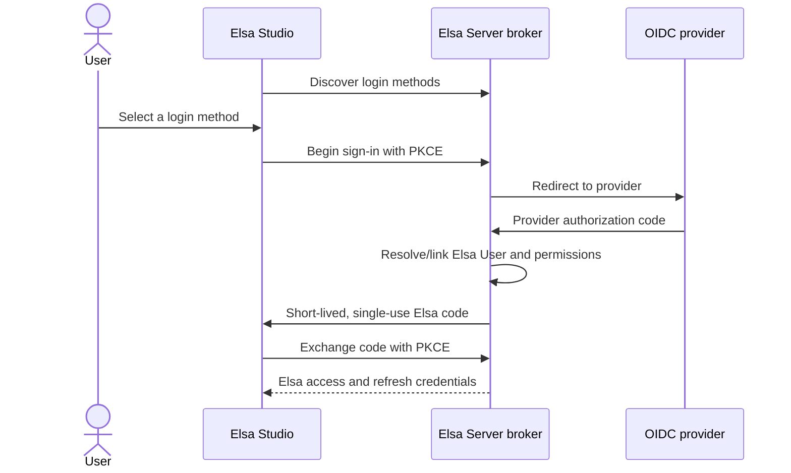

# External Authentication


**Preview in Elsa 3.8**

External Authentication is available starting with **Elsa 3.8**, which is currently under active development. The packages are preview-only and are published through the [Elsa Feedz preview feed](../../../getting-started/packages.md#previews). APIs, configuration, persistence migrations, and Studio screens can still change before general availability.


External Authentication is Elsa's brokered sign-in capability. Elsa Server becomes the relying party for one or more upstream identity providers, resolves the external identity to an Elsa User, and issues the Elsa credentials used by Studio. Provider tokens and client secrets do not pass through Studio.

Use this guide to:

- install the Core, provider-adapter, persistence, secret-binding, and Studio modules;
- register conventional Elsa hosts or CShells/Modular Server features;
- connect an OpenID Connect provider;
- configure both Blazor Server and WebAssembly Studio hosts;
- administer connections, identity links, previews, and sessions in Studio;
- harden single-node and multi-node deployments; and
- migrate safely from direct Studio OpenID Connect.

## Strategic Direction and Direct OIDC

Brokered External Authentication is the strategic successor to Studio's direct OpenID Connect mode and is the recommended direction for new deployments. It is especially useful when providers must be managed centrally or at runtime, when more than one login method is required, or when administrators need identity-link and session controls.

Direct OIDC is **not deprecated in Elsa 3.8**. It remains a supported, selectable mode throughout Elsa 3.x. Any removal requires parity, migration tooling, advance notice, and a future major release. See [Migrate from Direct OIDC](migration-from-direct-oidc.md) for a staged, reversible transition.

## Architecture

The upstream provider client and the Elsa **Authentication Client** are separate registrations:

- The provider client describes Elsa Server to the OIDC provider and owns the provider client ID, client secret, scopes, and Elsa callback URI.
- The Elsa Authentication Client describes Studio to the broker and owns Studio's exact callback, logout callback, allowed return paths, origin, and confidential-client secret where applicable. It grants no Elsa permissions.

## Choose Your Path

| You are... | Start here |
| --- | --- |
| Evaluating the feature | [Install External Authentication](installation.md), then [Keycloak Walkthrough](keycloak.md) |
| Integrating a conventional Elsa host | [Conventional host installation](installation.md#classic-addelsa-host) |
| Configuring CShells/Modular Server | [Modular Server installation](installation.md#cshells-modular-server) |
| Integrating Studio Server or WebAssembly | [Studio Integration](studio-integration.md) |
| Configuring connections and security policy | [Configuration Reference](configuration.md) |
| Administering a running environment | [Administration in Studio](administration.md) |
| Preparing a durable or multi-node deployment | [Production and Security](production.md) |
| Automating management | [REST API](api.md) |
| Migrating from direct OIDC | [Migrate from Direct OIDC](migration-from-direct-oidc.md) |
| Diagnosing a failed sign-in | [Troubleshooting](troubleshooting.md) |

## Capability Modules

The feature is intentionally split across Elsa Core and Elsa Studio:

| Area | Package | Purpose |
| --- | --- | --- |
| Core | `Elsa.ExternalAuthentication` | Broker, configuration, APIs, policies, in-memory development stores |
| Core | `Elsa.ExternalAuthentication.OpenIdConnect` | Built-in OpenID Connect protocol adapter |
| Core | `Elsa.ExternalAuthentication.Secrets` | Optional bridge for Elsa-managed secret values |
| Core | `Elsa.ExternalAuthentication.Persistence.EFCore.*` | Durable provider-specific persistence |
| Studio | `Elsa.Studio.ExternalAuthentication` | Login-method and administration UI |
| Studio | `Elsa.Studio.ExternalAuthentication.BlazorServer` | Confidential server-side broker client |
| Studio | `Elsa.Studio.ExternalAuthentication.BlazorWasm` | Public browser broker client with PKCE |

Both Studio hosting models are supported. Neither is universally preferred: [compare their trust and storage boundaries](studio-integration.md#packages-and-host-selection) and choose the model that fits your topology.

## Core Concepts

- **Identity Provider Connection**: Elsa's versioned trust relationship with an upstream provider. It can be deployment-owned configuration or administrator-owned persisted data.
- **Authentication Client**: a deployment-owned Studio or application registration at the Elsa broker. It is not an Elsa API application and grants no permissions.
- **External Identity Link**: a tenant-scoped association between a validated provider identity and an Elsa User.
- **External Authentication Session**: bounded session metadata used to validate refresh, connection state, expiry, and revocation.
- **Unlinked Identity Policy**: determines whether a first external sign-in is rejected, creates a user, or invokes an installed matcher.
- **Permission Grant Source**: converts trusted provider information into explicit Elsa authorization grants. Upstream roles never become Elsa permissions automatically.

In the current 3.8 preview UI, these resources appear under **Administration → Identity & access** as **Identity provider connections**, **External identity links**, and **Authentication sessions**.

## Scope of This Guide

This section documents deployment and operation of the built-in OIDC capability. The extension contracts for custom protocol adapters, policies, user matchers, permission grant sources, descriptor schemas, and custom Studio editors are introduced where relevant, but authoring those extensions is reserved for a dedicated developer guide.
