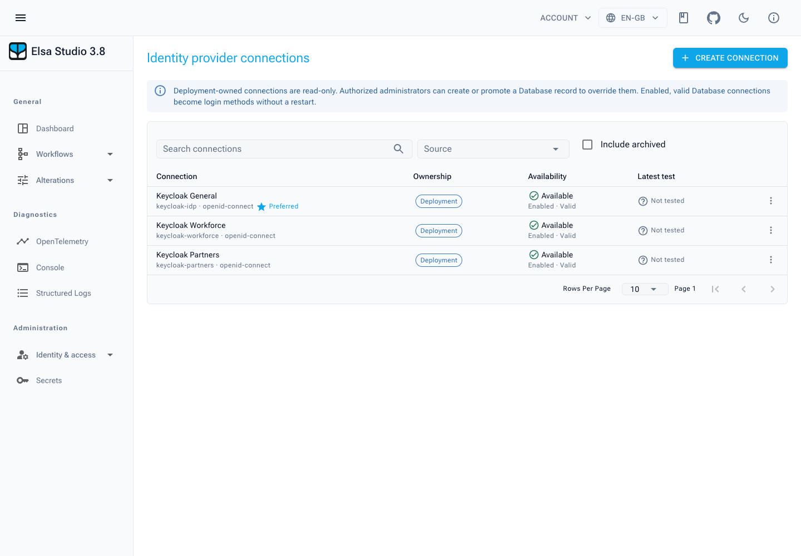
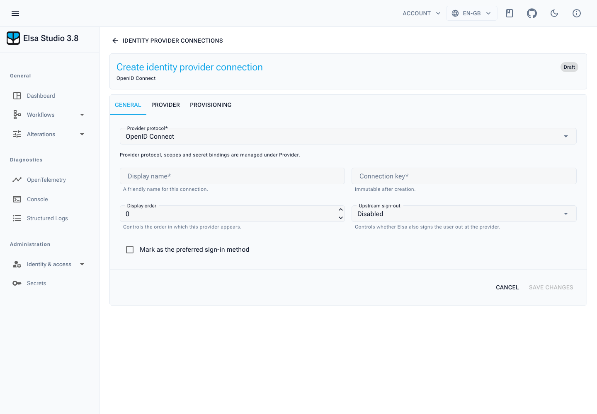
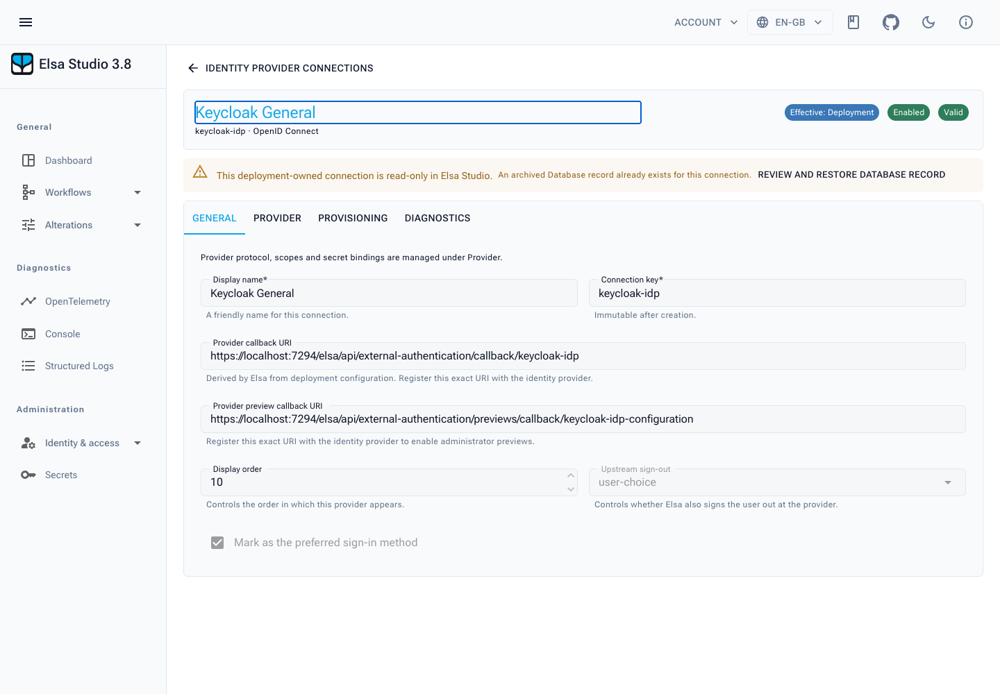
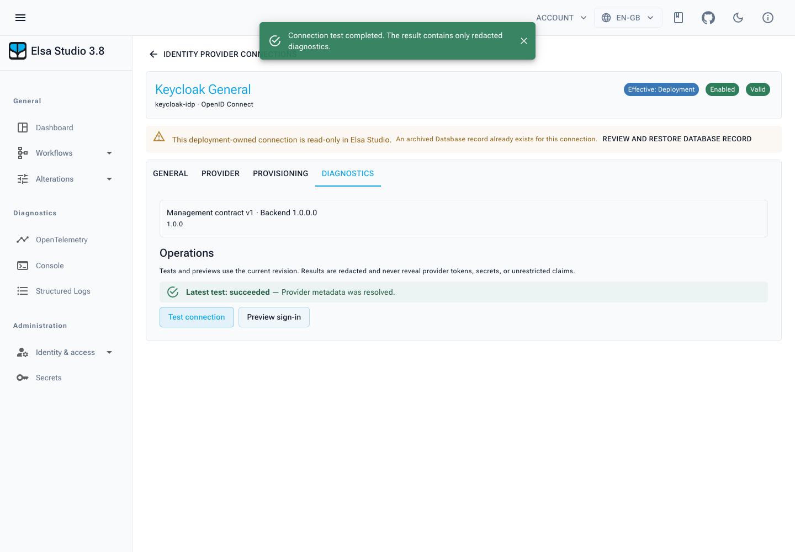
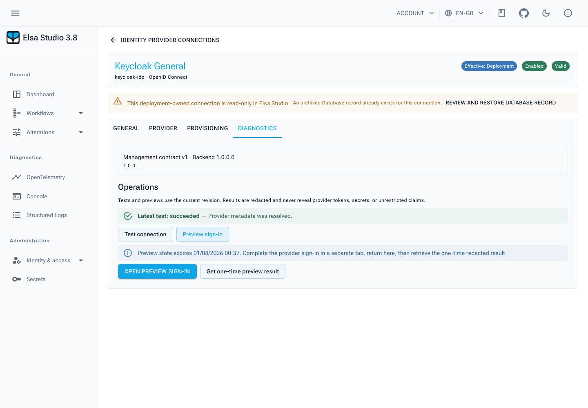
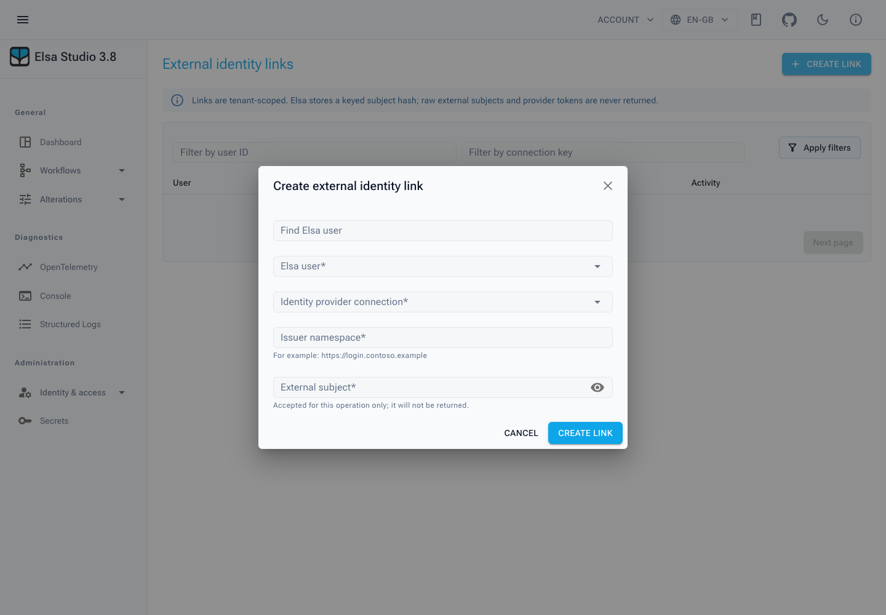
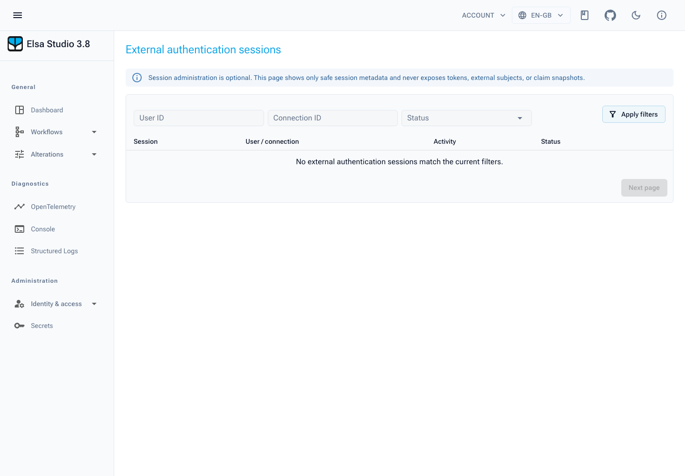

# External Authentication administration

> **Preview feature — Elsa 3.8.** This functionality is available from the
> Feedz.io preview feed while it remains under development. Verify matching
> Elsa Core and Studio preview versions before relying on a management action.

After a Studio host registers `Elsa.Studio.ExternalAuthentication`, its
**Administration → Identity & access** menu can expose an Elsa Server-backed
administration experience. The management
UI is feature-gated: it appears when Elsa Server advertises
`Elsa.ExternalAuthentication.ShellFeatures.ExternalAuthentication`. It is also
permission-gated; hidden controls do not replace Elsa API authorization.

<figure><figcaption>Identity provider connections under Administration and Identity & access, including deployment-owned connections and their current diagnostic state.</figcaption></figure>

## Routes and permissions

| Route | Purpose | Menu permission |
| --- | --- | --- |
| `/security/external-authentication/connections` | Manage identity-provider connections | `external-authentication:connections:read` |
| `/security/external-authentication/identity-links` | Prelink, replace, and unlink external identities | `external-authentication:links:manage` |
| `/security/external-authentication/sessions` | View and optionally revoke broker sessions | `external-authentication:sessions:read` |

Connection actions additionally use these permission strings:

| Action | Permission |
| --- | --- |
| Create connection or an allowed override | `external-authentication:connections:create` |
| Save, enable, disable, or promote an override | `external-authentication:connections:update` |
| Archive or restore | `external-authentication:connections:archive` |
| Test connection | `external-authentication:connections:test` |
| Preview sign-in | `external-authentication:connections:preview` |
| Configure unlinked-identity policy | `external-authentication:policies:manage` |
| Delegate connection permissions | `external-authentication:permissions:delegate` |
| Use unrestricted delegation | `external-authentication:permissions:delegate-unrestricted` |
| Configure unsafe provider settings | `external-authentication:provider-trust:unsafe` |
| Load roles for a create-user policy | `read:role` |
| Revoke a session | `external-authentication:sessions:revoke` |

`*` satisfies the Studio permission affordance checks, but grant only the
smallest set required. The Elsa Server endpoints remain authoritative: a screen
can be visible while a request is still denied by server-side policy.

## Connection management

Open **Administration > Identity & access > Identity provider connections**. The list supports searching,
filtering by source (`Database` or `Configuration`), showing archived records,
and cursor paging. It displays each connection's key, adapter, ownership,
availability, latest test observation, and whether it is preferred.

An enabled, valid database connection becomes a login method without restarting
Studio or Elsa Server. A connection listed as configuration-owned is supplied by
deployment configuration and has different edit rules.

### Create a database connection

1. Select **Create connection**.
2. Enter the immutable **Connection key**, display name, order, icon, adapter
   type, and provider settings shown by the server-provided adapter descriptor.
3. Supply required provider fields and write-only managed secrets where the
   server supports them.
4. Choose an unlinked-identity policy when required. Descriptor fields are
   rendered by Studio rather than entered as arbitrary JSON.
5. Save the draft, then use **Test connection**. Correct validation errors and
   repeat the test until the connection is valid.
6. Use **Preview sign-in** before enabling it when you need to validate the
   end-user identity/policy outcome.
7. Enable the connection only when it is ready to be discoverable at login.

<figure><figcaption>The database-connection editor starts with general metadata; adapter-specific provider settings and policies appear in their own tabs.</figcaption></figure>

Provider callback URLs are derived by Elsa Server from deployment-owned public
origin configuration. Studio displays them read-only; register the displayed
value with the upstream provider rather than attempting to edit it in Studio.

<figure><figcaption>A configuration-owned Keycloak connection. Its normal and preview callback URIs are deployment-derived and displayed read-only.</figcaption></figure>

### Configuration-owned connections and overrides

Configuration-owned connections remain visible but read-only. Their provider
and secret configuration belongs to the deployment.

When both conditions are true, Studio offers **Create full Database override**:

1. The actor has the connection create permission.
2. Elsa Server advertises that a configuration override is allowed for the
   connection (`canCreateOverride`).

Creating the override produces an explicit complete database record. Secret
bindings are cleared: they are never cloned from configuration, so an
administrator must deliberately reconfigure required secrets before enabling
the override. A database override can shadow the deployment connection even
while disabled. Archiving the override reveals the configuration connection
again.

Do not treat an override as a way to export deployment configuration. It is a
new record with a deliberate configuration boundary.

### Secrets

Secret fields are write-only. When Elsa Server advertises an installed managed
secret resolver, Studio lets an authorized user choose the resolver and submit a
replacement value. The value goes only to the managed-secret replacement
endpoint; Studio clears its local input and the response exposes only ownership,
configured state, and resolvability—not the value.

- Deployment-managed resolver/reference bindings are neither displayed nor
  editable in Studio.
- If the server has no managed resolver, Studio hides the managed editor and
  explains why.
- A required managed secret cannot be removed while the connection is enabled.
  Disable the connection first, then remove or replace the binding.
- Never paste a secret into a ticket, browser console capture, exported screen
  shot, or source-controlled configuration.

### Provider settings, policies, and roles

Adapters supply field descriptors, validation, capabilities, and (optionally) a
custom editor contract. Studio uses these server-provided descriptors for
provider-specific fields, so the available fields vary by adapter and preview
version.

For unlinked identities, the policy form is descriptor-driven:

- `match-user` is shown only when Elsa Server advertises an installed user
  matcher. Studio renders that matcher's fields and required claim types.
- Create-user outcomes load available roles from `/identity/roles`.
- Loading roles requires `read:role`. If roles cannot be loaded, the role
  picker becomes read-only and warns the operator instead of accepting raw role
  IDs.

Although the contract contains permission and claim mapping DTOs, this preview
does not expose customer-facing mapping or permission-preview editors. Do not
document those as an available Studio workflow.

### Test connection and Preview sign-in

**Test connection** performs an on-demand server-side diagnostic and records a
redacted observation with status, category, summary, warnings, duration, and
correlation ID. It never returns provider access tokens.

<figure><figcaption>A successful live metadata test. The diagnostic result is deliberately redacted and includes a correlation ID for server-side investigation.</figcaption></figure>

**Preview sign-in** verifies a connection's effective current revision in a
separate tab. It returns a one-time, redacted result such as issuer, masked
subject, policy decision, projected safe claims, proposed action, and warnings.
It does **not** create a user, identity link, credential, or normal session.

<figure><figcaption>Preview sign-in uses a separate tab and a one-time result. It exercises the effective connection without creating a normal session.</figcaption></figure>

Use the preview when validating a newly configured provider or policy. It is
not a substitute for testing the complete Studio login flow with a non-admin
test account.

### Enable, disable, archive, and restore

- **Enable** exposes an enabled, valid database connection through login
  discovery.
- **Disable** stops normal discovery without deleting the record. Existing
  external sessions can remain active until expiry or may be revoked when the
  operator has session-revocation permission.
- **Archive** removes the connection from login discovery but preserves identity
  links. It can be restored later.
- **Restore** restores the record as disabled; validate and explicitly enable
  it before it can be used for normal login.

Disabling the final normal login method is a recovery-sensitive action. Studio
requires an explicit confirmation that an independent recovery path has been
verified. Break-glass authentication remains outside normal login discovery;
do not approve this override merely to remove a failing provider.

## Identity links

Open **Administration > Identity & access > External identity links** to associate an existing Elsa user
with an external identity before first sign-in, replace the association, or
remove it.

<figure><figcaption>Prelink an exact upstream issuer and subject to an existing Elsa user before first sign-in.</figcaption></figure>

### Prelink an identity

1. Select **Create external identity link**.
2. Select the Elsa user and the connection key.
3. Enter the upstream issuer and subject exactly as supplied by the provider.
4. Create the link.

The operation sends `UserId`, `ConnectionKey`, `Issuer`, and `Subject` to Elsa
Server. It avoids relying on a first-login matching outcome where an account
must be explicitly associated in advance.

### Replace or unlink

- **Replace link** changes the identity association for an existing link; the
  UI warns that sign-in history is reset.
- **Unlink** removes the association after confirmation. The user can no longer
  sign in through that external identity unless another policy/link permits it.

Use tenant and user identifiers carefully. This page is intended for operators
who understand the identity source; it is not a general user-profile editor.

## Session administration

**Administration > Identity & access > Authentication sessions** is optional and appears with
`external-authentication:sessions:read`. It supports filters for user ID,
connection key, and active/revoked status, plus cursor paging.

The page intentionally shows only safe metadata: session ID, user ID, tenant
ID, connection key, start time, last refresh time, expiry, revocation time, and
status. It never exposes tokens, external subjects, or claim snapshots.

<figure><figcaption>The session administration page exposes operational metadata only; tokens and upstream identity values never appear.</figcaption></figure>

With `external-authentication:sessions:revoke`, select **Revoke** and confirm.
The request uses the `administrator_revoked` reason; the user must authenticate
again. Revocation cannot recover or reveal the session's tokens.

## Operational checklist

Before announcing a new connection to users:

- [ ] The connection is valid and has a current successful test observation.
- [ ] A preview sign-in gives the intended policy result and no unexplained
  warnings.
- [ ] Required managed secrets are configured/resolvable and not copied from a
  configuration-owned record.
- [ ] The upstream callback URI is the read-only URI Elsa Server reports.
- [ ] The intended normal and recovery login paths have been tested.
- [ ] Administrators have least-privilege connection, link, and session
  permissions.
- [ ] A rollback/recovery decision is ready before disabling the previous final
  login method.

For the Studio host setup, see [Studio integration](studio-integration.md). For
errors, callback mismatches, authorization failures, and safe diagnostic steps,
see [Troubleshooting](troubleshooting.md).
