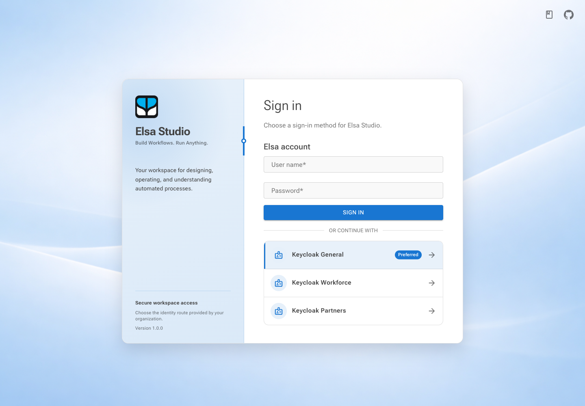
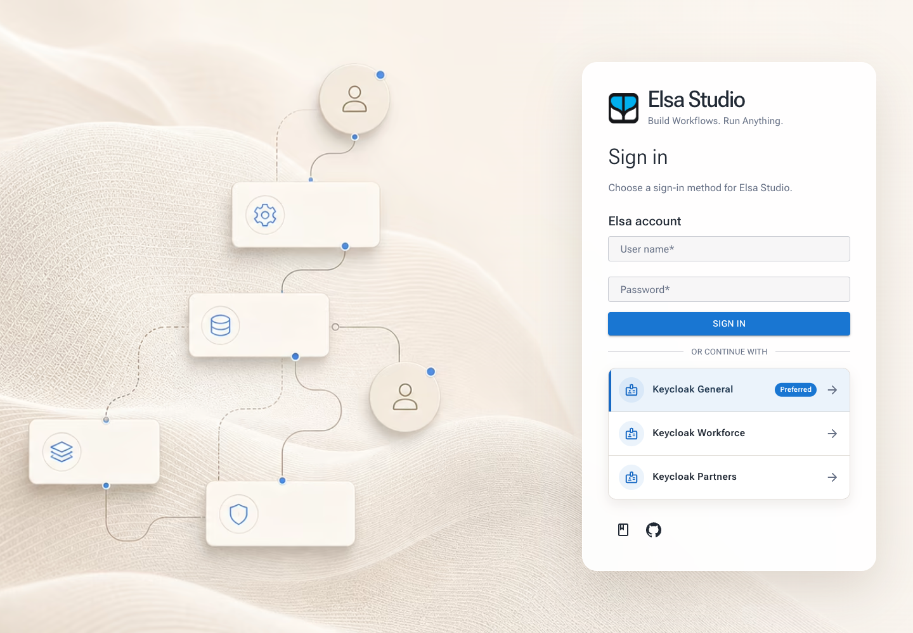

# Studio integration

> **Preview feature — Elsa 3.8.** External Authentication is new in Elsa 3.8
> and is currently available only from the Feedz.io preview feed while the
> feature is under development. Contracts, package names, and screens can
> change before the stable release. Validate the exact preview versions of Elsa
> Core and Elsa Studio together before using this in production.

External Authentication makes Elsa Server the authentication broker for Studio.
Studio asks Elsa Server which sign-in methods are available, starts the selected
connection, and exchanges the resulting one-time completion code for an Elsa
credential. This differs from Studio's direct OpenID Connect integration:
Studio no longer talks directly to each upstream identity provider.

Use this mode when Elsa should centrally manage the available upstream
connections at runtime. It is an opt-in Studio mode; it does not change the
existing direct `OpenIdConnect` or `ElsaIdentity` modes.

<figure><figcaption>The broker-backed login chooser in the Blazor Server host. A preferred method is highlighted but is never started automatically.</figcaption></figure>

## Before you start

Complete the Elsa Server External Authentication setup first:

1. Install matching Elsa 3.8 preview Core and Studio packages from the
   Feedz.io preview feed.
2. Enable and configure External Authentication in Elsa Server, including at
   least one enabled, valid connection or a broker-local sign-in path.
3. Create a dedicated **Elsa Authentication Client** for Studio. This is not
   an Elsa API Application and grants no permissions.
4. Register Studio's exact sign-in and logout callback URLs, allowed local
   return paths, and—for a WebAssembly client—the exact Studio origin.
5. Ensure the signed-in user receives Elsa `permissions` claims needed for
   Studio and any management actions they will perform.

Do not use this guide to configure an upstream provider directly in Studio.
Configure its discovery, trust, client credentials, scopes, policy, and claim
handling on the Elsa Server connection instead.

## Packages and host selection

Add the shared management/UI package plus exactly one package matching the
Studio hosting model:

```bash
dotnet add package Elsa.Studio.ExternalAuthentication --prerelease
# Choose one host package:
dotnet add package Elsa.Studio.ExternalAuthentication.BlazorServer --prerelease
# or
dotnet add package Elsa.Studio.ExternalAuthentication.BlazorWasm --prerelease
```

Confirm that every Elsa Core and Studio package resolved to the same
`3.8.0-preview.*` build, then pin that resolved build for repeatable restores.

| Hosting model | Packages | Broker client type |
| --- | --- | --- |
| Blazor Server | `Elsa.Studio.ExternalAuthentication`, `Elsa.Studio.ExternalAuthentication.BlazorServer` | Confidential |
| Blazor WebAssembly | `Elsa.Studio.ExternalAuthentication`, `Elsa.Studio.ExternalAuthentication.BlazorWasm` | Public, PKCE required |

The shared package contributes the login methods and security-management UI.
The host package sets the credential boundary, authentication state provider,
API handler, SignalR token configuration, and sign-out entry point.

The WebAssembly package also requires this script in the host page (normally
`wwwroot/index.html`):

```html
<script src="_content/Elsa.Studio.ExternalAuthentication.BlazorWasm/external-authentication.js"></script>
```

The script provides the browser Web Crypto and browser-storage functions used
for PKCE and tokens. Place it before the Blazor WebAssembly bootstrap script.

## Select the authentication mode

Set the Studio host configuration value below. A host must select one provider:
`ExternalAuthentication`, `OpenIdConnect`, `ElsaIdentity`, or legacy
`ElsaLogin`.

```json
{
  "Authentication": {
    "Provider": "ExternalAuthentication"
  }
}
```

Do not mix direct OIDC and broker registrations in the same host. Startup
validation rejects combinations of legacy login, Elsa Identity, direct OIDC,
and broker registrations that would select different trust models.

The management module can be registered in a host regardless of the selected
provider, but its menu is shown only when the Elsa Server External
Authentication feature is available. Broker sign-in becomes active only when
`Authentication:Provider` is `ExternalAuthentication`.

## Register services

Register the host-specific broker service when the selected provider is
`ExternalAuthentication`, and set the broker handler as the remote backend
authentication handler. Then register the shared module after creating the
remote-backend configuration.

### Blazor Server

```csharp
using Elsa.Studio.ExternalAuthentication.BlazorServer.Extensions;
using Elsa.Studio.ExternalAuthentication.BlazorServer.HttpMessageHandlers;
using Elsa.Studio.ExternalAuthentication.Extensions;

// When Authentication:Provider is ExternalAuthentication.
builder.Services.AddExternalAuthenticationBroker(options =>
    builder.Configuration
        .GetSection("Authentication:ExternalAuthentication")
        .Bind(options));

var backendApiConfig = new BackendApiConfig
{
    ConfigureBackendOptions = options =>
        builder.Configuration.GetSection("Backend").Bind(options),
    ConfigureHttpClientBuilder = options =>
        options.AuthenticationHandler =
            typeof(ExternalAuthenticationAuthenticatingApiHttpMessageHandler)
};

builder.Services.AddRemoteBackend(backendApiConfig);
builder.Services.AddExternalAuthenticationModule(backendApiConfig);
```

The host must also use the normal ASP.NET Core authentication and authorization
middleware and map controllers. The broker package supplies the Server callback
controller:

```csharp
app.UseAuthentication();
app.UseAuthorization();
app.MapControllers();
```

### Blazor WebAssembly

```csharp
using Elsa.Studio.ExternalAuthentication.BlazorWasm.Extensions;
using Elsa.Studio.ExternalAuthentication.BlazorWasm.HttpMessageHandlers;
using Elsa.Studio.ExternalAuthentication.Extensions;

// When Authentication:Provider is ExternalAuthentication.
builder.Services.AddExternalAuthenticationBroker(options =>
    builder.Configuration
        .GetSection("Authentication:ExternalAuthentication")
        .Bind(options));

var backendApiConfig = new BackendApiConfig
{
    ConfigureBackendOptions = options =>
        builder.Configuration.GetSection("Backend").Bind(options),
    ConfigureHttpClientBuilder = options =>
        options.AuthenticationHandler =
            typeof(ExternalAuthenticationAuthenticatingApiHttpMessageHandler)
};

builder.Services.AddRemoteBackend(backendApiConfig);
builder.Services.AddExternalAuthenticationModule(backendApiConfig);
```

The package registers the callback pages at the fixed client-local paths. Do
not add a competing callback route.

## Configuration reference

All settings below bind from `Authentication:ExternalAuthentication`.

| Setting | Server | WASM | Notes |
| --- | --- | --- | --- |
| `ClientId` | Required | Required | The deployment-managed Elsa Authentication Client identifier. |
| `ClientSecret` | Required | Forbidden | A WASM public client must never contain a client secret. |
| `CallbackPath` | Fixed | Fixed | Must be `/authentication/external/callback`. |
| `LogoutCallbackPath` | Fixed | Fixed | Must be `/authentication/external/logout-callback`. |
| `BrowserStorage` | N/A | Optional | `Memory`, `Session`, or `Durable`; default is `Memory`. |

Custom callback paths are rejected at startup. Register the **absolute** values
formed from the public Studio URL and these paths with the Elsa Authentication
Client. For example, if the Studio public URL is
`https://studio.example.com`, register:

```text
https://studio.example.com/authentication/external/callback
https://studio.example.com/authentication/external/logout-callback
```

If Studio is behind a reverse proxy, make sure the request scheme and host seen
by the Server host are the public values. Otherwise it will construct a callback
URI that does not match the URL registered with Elsa Server.

### Blazor Server example

Store the secret in a secret provider, environment variable, or deployment
configuration—not in source control.

```json
{
  "Backend": {
    "Url": "https://elsa.example.com/elsa/api"
  },
  "Authentication": {
    "Provider": "ExternalAuthentication",
    "ExternalAuthentication": {
      "ClientId": "elsa-studio-server",
      "ClientSecret": "<resolved by deployment secret configuration>",
      "CallbackPath": "/authentication/external/callback",
      "LogoutCallbackPath": "/authentication/external/logout-callback"
    }
  }
}
```

Server uses a confidential client. It exchanges the authorization code on the
server and keeps the access/refresh credentials in a server-side ticket store.
The browser receives an `ElsaStudio.ExternalAuthentication` cookie that is
secure, HTTP-only, `SameSite=Lax`, non-sliding, and has an eight-hour lifetime.
The refresh credential is never exposed to Blazor components or browser code.

### Blazor WebAssembly example

```json
{
  "Backend": {
    "Url": "https://elsa.example.com/elsa/api"
  },
  "Authentication": {
    "Provider": "ExternalAuthentication",
    "ExternalAuthentication": {
      "ClientId": "elsa-studio-wasm",
      "CallbackPath": "/authentication/external/callback",
      "LogoutCallbackPath": "/authentication/external/logout-callback",
      "BrowserStorage": "Memory"
    }
  }
}
```

WASM is a public client. It creates S256 PKCE verifier/state values in the
browser, validates the exact callback origin/path, exchanges the one-time code
with the broker, and attaches the Elsa access token to backend API and SignalR
connections.

<figure><figcaption>The same broker-backed chooser in the WebAssembly host. The hosting models offer the same user choice while using different credential boundaries.</figcaption></figure>

### CORS for WebAssembly

The Authentication Client's `AllowedOrigins` setting validates which browser
origin may participate in the broker flow. It does **not** configure ASP.NET
Core CORS for Elsa API requests. For a WebAssembly deployment, register the
exact public Studio origin in both places:

1. Add the origin to the public Elsa Authentication Client's
   `AllowedOrigins` collection.
2. Configure an ASP.NET Core CORS policy on the Elsa Server host that permits
   that origin, the API methods and headers Studio uses, and WebSocket/SignalR
   access where applicable.
3. Apply the policy before authentication, authorization, and endpoint mapping.

Do not combine credentialed requests with `AllowAnyOrigin`. Keep development
ports in sync too: `https://localhost:7052` and
`https://studio.example.com` are different origins.

### `BrowserStorage` decision

| Value | Token lifetime in the browser | Use when | Trade-off |
| --- | --- | --- | --- |
| `Memory` | Current running app only | Default/recommended setting | User signs in again after reload, a new tab, or tab close. |
| `Session` | Current browser tab | Reload continuity is needed | Browser script compromise can access tokens; close the tab when finished. |
| `Durable` | Local storage beyond session | Persistent sign-in is an explicit requirement | Largest exposure to browser script compromise and shared-device use. |

`Session` and `Durable` produce a startup security warning. Use them only after
assessing XSS controls, device sharing, and the impact of a stolen browser
token. Neither option turns a public WASM client into a confidential client.

## Sign-in and sign-out sequence

1. Studio loads `/login` and anonymously requests the available methods for
   its `ClientId` from Elsa Server.
2. Elsa Server returns presentation-only local and/or external methods plus an
   optional preferred method key.
3. The user explicitly chooses an external provider or enters broker-local
   credentials. A preferred method is highlighted only; Studio never starts it
   automatically.
4. Studio starts an authorization-code request using `response_type=code` and
   S256 PKCE. Server hosts retain PKCE state/verifier server-side; WASM retains
   a short-lived browser transaction.
5. The upstream/provider flow returns an opaque completion code to the fixed
   Studio callback.
6. Studio consumes callback state once, exchanges the code at Elsa Server, and
   sends the user only to a validated local return path. Invalid, external,
   backslash, or `//` return paths become `/`.
7. API calls and SignalR receive the current Elsa access token through the
   registered authentication handler.

On sign-out, Studio supports `local` and `upstream` modes. Local sign-out is
always completed even if Elsa Server or the upstream provider cannot be reached.
An upstream continuation is accepted only when it is an Elsa Server same-origin
logout route, then returns to the fixed logout callback.

## Moving from direct OIDC

`OpenIdConnect` and `ExternalAuthentication` are separate deployment modes.
Plan a controlled change:

1. Keep `Authentication:Provider` set to `OpenIdConnect`.
2. Configure and test the Elsa broker connection and a separate Studio
   Authentication Client.
3. Keep direct and broker client secrets in their existing deployment-owned
   secret stores; no Studio screen or migration copies a secret.
4. Change the provider value to `ExternalAuthentication` and restart Studio.
5. Verify sign-in, refresh, backend authorization, SignalR, and both logout
   modes.

To roll back, restore `Authentication:Provider` to `OpenIdConnect` and restart
Studio. The broker does not change the retained direct OIDC settings.

## Verify the integration

After deployment, confirm all of the following:

- `/login` shows only the methods Elsa Server exposes to the Studio client.
- Selecting a provider opens the expected Elsa-managed authorization flow; it
  does not automatically launch merely because it is preferred.
- Callback and logout callback match the registered public URLs exactly.
- A signed-in user can load Studio and call an authorized Elsa API.
- A user without a required `permissions` claim receives the expected API
  authorization result rather than a misleading sign-in success.
- Server credentials do not appear in browser storage, URLs, page markup, or
  logs. For WASM, verify the configured storage behavior deliberately.

For management, testing, and operational verification, see
[External Authentication administration](administration.md). For failures and
diagnostic steps, see [Troubleshooting](troubleshooting.md).
