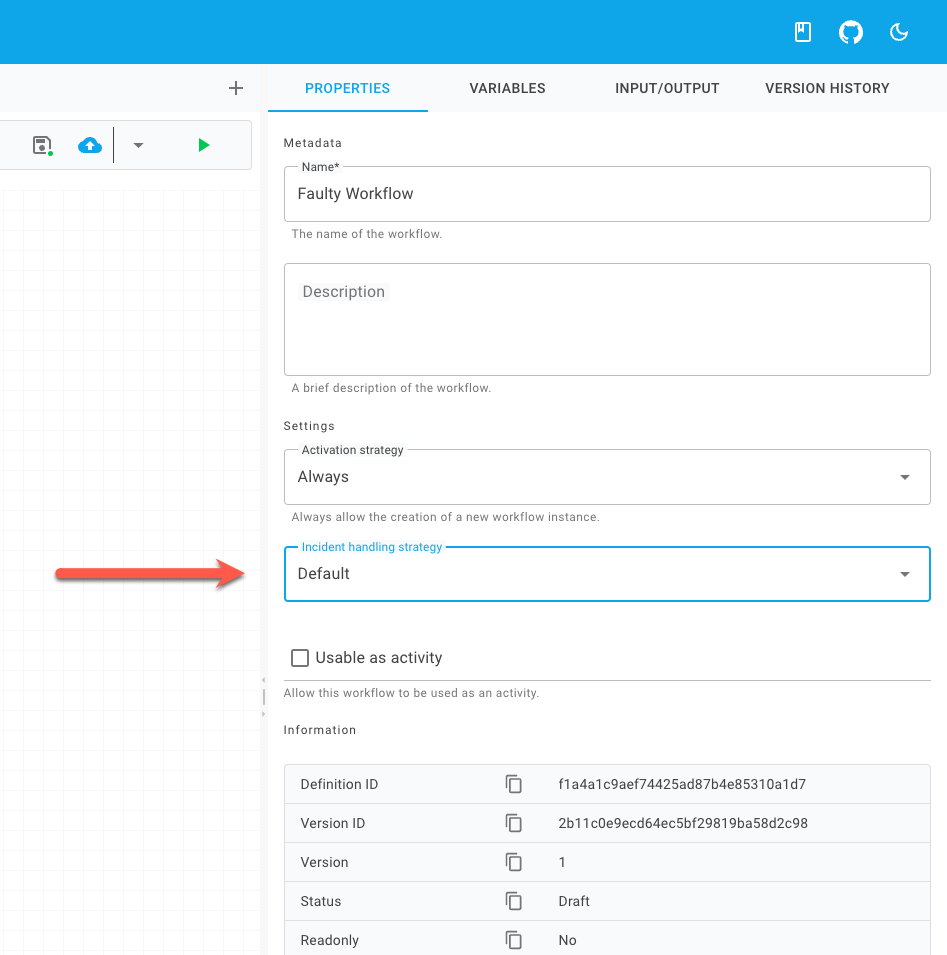

# Configuration

In `release/3.8.0`, incident strategy resolution happens in this order:

1. the workflow definition's `WorkflowOptions.IncidentStrategyType`
2. the host-level `IncidentOptions.DefaultIncidentStrategy`
3. Elsa's built-in fallback: `FaultStrategy`

This resolution order is implemented by `DefaultIncidentStrategyResolver`.

## Configure a global default

Set a host-wide default when you want most workflows to behave the same way on
activity faults:

```csharp
using Elsa.Workflows.Core.IncidentStrategies;
using Elsa.Workflows.Core.Options;

builder.Services.Configure<IncidentOptions>(options =>
{
    options.DefaultIncidentStrategy = typeof(ContinueWithIncidentsStrategy);
});
```

If a workflow does not specify its own incident strategy, Elsa uses this
default.

If you do not configure `IncidentOptions.DefaultIncidentStrategy`, Elsa falls
back to `FaultStrategy`.

## Configure a specific workflow

Set `builder.WorkflowOptions.IncidentStrategyType` inside the workflow when one
workflow needs behavior different from the host default:

```csharp
using Elsa.Workflows;
using Elsa.Workflows.Core.IncidentStrategies;

public class MyWorkflow : WorkflowBase
{
    protected override void Build(IWorkflowBuilder builder)
    {
        builder.WorkflowOptions.IncidentStrategyType = typeof(ContinueWithIncidentsStrategy);
    }
}
```

This setting is serialized with the workflow definition and wins over the
host-level default.

## Configure it in Elsa Studio

Studio loads the available strategies from:

```http
GET /descriptors/incident-strategies
```

That endpoint returns the registered `IIncidentStrategy` implementations and
their display metadata. When you pick one in the workflow definition settings,
Studio stores the selected type alias or type name in
`WorkflowDefinition.Options.IncidentStrategyType`.

<figure><figcaption></figcaption></figure>

## Register custom strategies

If you create your own `IIncidentStrategy`, register it with dependency
injection so Elsa can resolve it and so Studio can list it from the descriptors
endpoint:

```csharp
builder.Services.AddTransient<IIncidentStrategy, MyIncidentStrategy>();
```

If you want that custom strategy to become the default, also assign its type to
`IncidentOptions.DefaultIncidentStrategy`.

## What this setting does not configure

Incident strategies do not replace activity-level retry policies.

- Use [resilience strategies](README.md#2-use-resilience-retries-for-transient-activity-failures)
  when an activity should retry automatically before faulting.
- Use the [alterations retry endpoint](../../features/alterations/applying-alterations/rest-api.md)
  when an already faulted workflow instance needs operator-driven retry.
