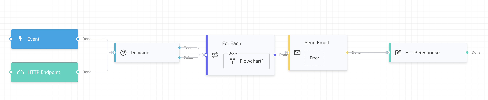

# Workflow Editor (3.5-preview)

As of version 3.5.0, the default workflow editor got a minor UI refresh.

<figure><figcaption></figcaption></figure>

However, if you prefer the previous look, change the following in your Blazor projects Program.cs:&#x20;

```csharp
builder.Services.AddServerSideBlazor(options =>
{
    // Comment out the V2 activity wrapper (default).
    //options.RootComponents.RegisterCustomElsaStudioElements();
    
    // To use V1 activity wrapper layout, specify the V1 component instead:
    options.RootComponents.RegisterCustomElsaStudioElements(typeof(Elsa.Studio.Workflows.Designer.Components.ActivityWrappers.V1.EmbeddedActivityWrapper));
    
    options.RootComponents.MaxJSRootComponents = 1000;
});

// Add this for the V1 designer theme (default is V2).
builder.Services.Configure<DesignerOptions>(options =>
{
    options.DesignerCssClass = "elsa-flowchart-diagram-designer-v1";
    options.GraphSettings.Grid.Type = "mesh";
});
```

In the \_Host.cshtml file (or index.html in case of WebAssembly), in he `<head>` element:

```cshtml
@* Comment out the V2 designer.css. *@
@* <link href="_content/Elsa.Studio.Workflows.Designer/designer.css" rel="stylesheet"> *@
    
@* To use designer.v1.css for the old designer. *@
<link href="_content/Elsa.Studio.Workflows.Designer/designer.v1.css" rel="stylesheet">
```

You should now have the old design back.

<figure><figcaption></figcaption></figure>
