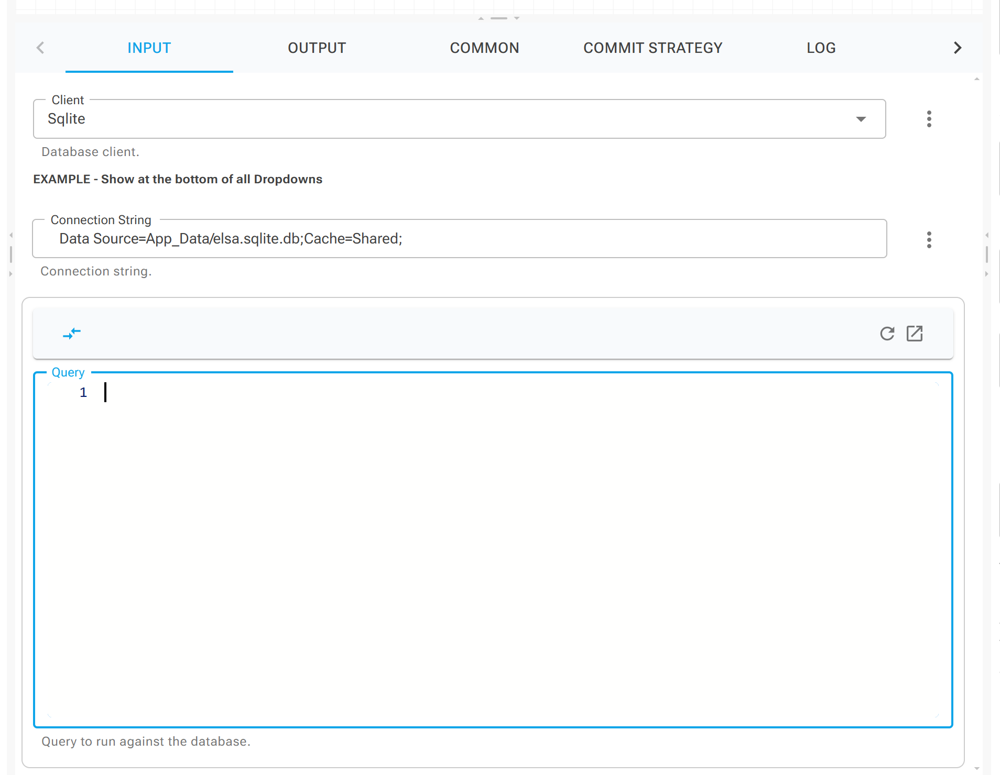

# Field Extensions

## Overview

Field extensions allow you to add functionality to activity elements directly within the studio, rather than on the Elsa Server side. Extension can be ordered and filtered to render on either, All components, specific `InputUIHints` components, specific activity names or `InputAttribute.DefaultSyntax`.&#x20;

## Example

In this example, a simple field extension is applied to the **Client** property. It displays a message beneath all `InputUiHint.DropDown`'s, and an additional toolbar at the top of the query editor—shown only when the syntax type is `"sql"`.

<figure><figcaption></figcaption></figure>

## Creating a field extension

To create a field extension you can implement the `IFieldExtension` interface:

```csharp
public interface IUIFieldExtensionHandler
{
    // The order in which the extensions should be displayed.
    int DisplayOrder { get; set; }

    // If set to true and no restricting types are set, either with <c>UIHintComponent</c>, <c>ActivityTypes</c> or <c>Syntaxes</c>, this extension will be rendered for in all field types.
    bool IncludeForAll { get; set; }

    // The position to render the extension within the field.
    FieldExtensionPosition Position { get; set; }

    // The UIHint component this extension should be rendered for.
    string UIHintComponent { get; set; }

    // The activities this extension should be rendered for.
    List<string> ActivityTypes { get; set; }

    // The syntaxes this extension should be rendered for.
    List<string> Syntaxes { get; set; }

    // Returns true if the handler extension the specified or is empty.
    bool GetExtensionForInputComponent(string componentName);

    // Returns a <see cref="RenderFragment"/> of the added extension.
    RenderFragment DisplayExtension(DisplayInputEditorContext context);
}
```

Then register the custom extension with DI.

```csharp
// Register the field enhancer with DI.
services.AddUIFieldEnhancerHandler<CustomFieldExtension>();
```

All relevant elements will now have this extension automatically applied.
